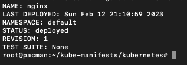
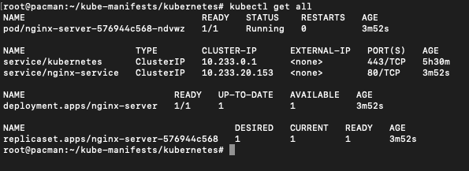
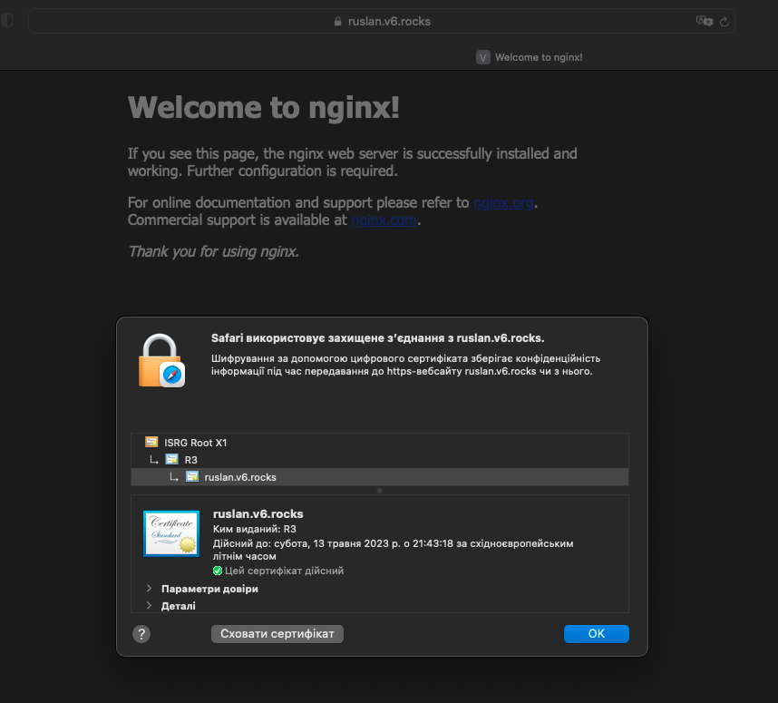
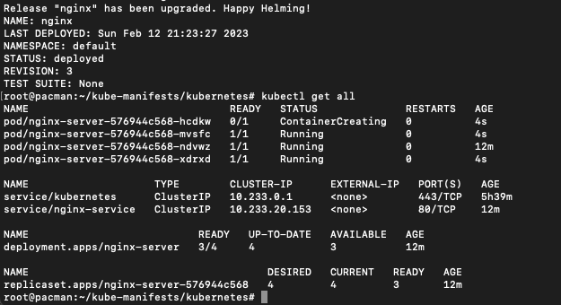
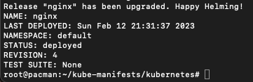
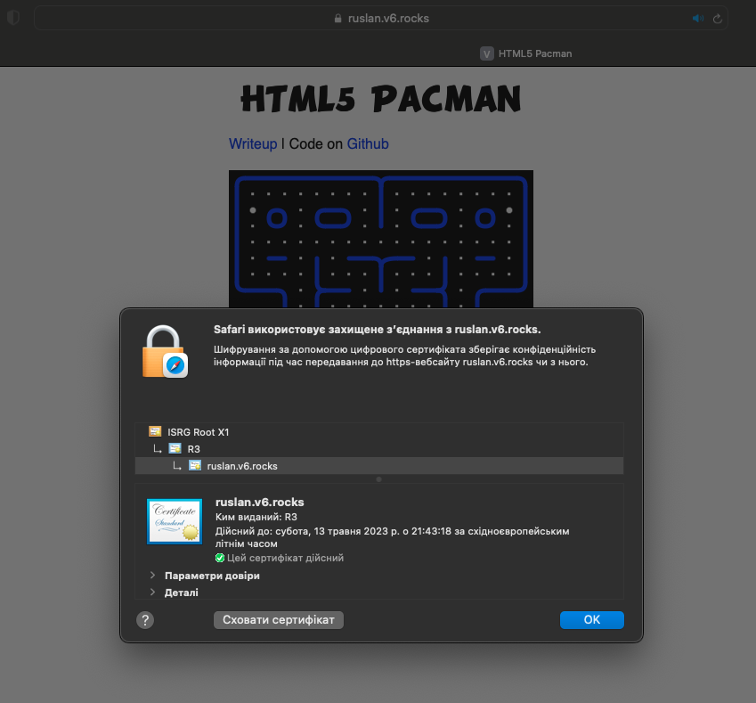

# Task4.-K8S-HELM
Using knowledge gained on previous [leson](https://github.com/Heckfy05/Task3.-K8S) was deployed K8S using kubesprey  on GCP instance. Created and registreted domain [ruslan.v6.rocks](https://ruslan.v6.rocks), configured [cert-manager](https://cert-manager.io/) with Letsencrypt.

#### 1. Deploy Nginx via helm with Ingress configuration 
Set variables via value yaml
Use “helm upgrade --install --atomic …” to change some parameters (Example: number of pods)
##### 1.1 Installing HELM
[Offical documentation](https://helm.sh/docs/intro/install/#helm) giude how to do it. Executing:
```
curl -fsSL -o get_helm.sh https://raw.githubusercontent.com/helm/helm/main/scripts/get-helm-3
chmod 700 get_helm.sh
./get_helm.sh
```
##### 1.2 Deploying NGINX
Using [Chart](nginx/) deploying Ngingx with configured 
Service and Ingress.
```
helm install nginx nginx/
```




Resoult:



Upgraining deployment by increasing replicas to 4
```
helm upgrade --set replicaCount=4 nginx nginx/
```


#### 2. Create and deploy your own chart with the [Pacman](https://hub.docker.com/r/golucky5/pacman) game.

Using previous [Nginx Chart](nginx/) we upgrade the previous deployment by changing the container image:
```
helm upgrade --set container.image=golucky5/pacman nginx nginx/
```



